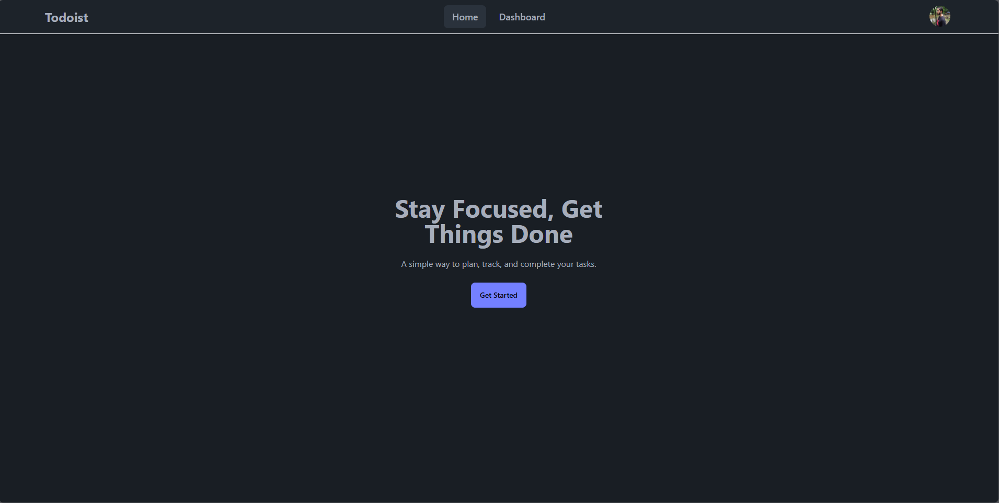

# Todoist

A fully responsive task management application for you to manage your tasks. The task application uses fluid drag and drop action for you too keep track of your tasks. Also you can perform CRUD operations.

## [Live Link](https://todoist-1adad.web.app/).

---

### Technologies Used

---

- React
- Express
- MongoDB
- Firebase

### Features of the website:

---

- Shows toast on any CRUD operation.
- Uses firebase for authentication.
- User can update status using drag and drop feature.

### Dependencies Used:

---

- Axios
- react-beautiful-dnd
- React Toastify
- Tanstack Query

### [Server Link](https://github.com/adnansyed101/todoist-server).

